# HR Policy Assistant - Architecture Diagram

## System Architecture Flowchart

## Component Interaction Flow

## Folder Structure & Responsibilities

```mermaid
graph LR
    Root[h:/aiml/agentic/] --> Frontend[frontend/]
    Root --> Backend[backend/]
    Root --> Data[data/]
    Root --> Config[config/]
    
    Frontend --> App[app.py<br/>📱 Streamlit UI<br/>• Chat interface<br/>• User interaction<br/>• Display messages]
    
    Backend --> HRAgent[hr_agent.py<br/>🤖 Orchestration<br/>• Manage conversation<br/>• Coordinate retrieval<br/>• Call LLM]
    Backend --> Tools[tools.py<br/>🔍 Policy Search<br/>• Load documents<br/>• Keyword matching<br/>• Return snippets]
    Backend --> Prompts[prompts.py<br/>📝 Instructions<br/>• System prompt<br/>• AI guidelines]
    
    Data --> Policies[policies/<br/>📄 HR Documents<br/>• leave_policy.txt<br/>• wfh_policy.txt<br/>• general_hr_policy.txt]
    
    Config --> ConfigFile[config.yaml<br/>⚙️ Settings<br/>• Ollama config<br/>• Agent parameters]
    
    classDef frontend fill:#e3f2fd,stroke:#2196f3
    classDef backend fill:#f5f5f5,stroke:#4caf50
    classDef data fill:#fff3e0,stroke:#ff9800
    
    class Frontend,App frontend
    class Backend,HRAgent,Tools,Prompts backend
    class Data,Policies,Config,ConfigFile data
```

## Data Flow Architecture

## Technology Stack

## LangChain Node Architecture

```mermaid
flowchart TD
    subgraph LangChainCore["LangChain Core Components"]
        InputNode["📥 Input Node<br/>User Message"]
        RetrieverNode["🔍 Retriever Node<br/>PolicyRetriever<br/>Keyword Search"]
        PromptNode["📝 Prompt Node<br/>SystemPrompt Template<br/>+ Context Builder"]
        LLMNode["🤖 LLM Node<br/>Ollama/Mistral<br/>Temperature: 0.7"]
        OutputNode["📤 Output Node<br/>Generated Response"]
        MemoryNode["💾 Memory Node<br/>Conversation Buffer<br/>Max 10 turns"]
    end
    
    subgraph LangChainFlow["Data Flow Through Nodes"]
        InputNode -->|Query Text| RetrieverNode
        InputNode -->|Message| MemoryNode
        MemoryNode -->|Chat History| PromptNode
        RetrieverNode -->|Policy Context| PromptNode
        PromptNode -->|Formatted Prompt| LLMNode
        LLMNode -->|Response Text| OutputNode
        OutputNode -->|Store| MemoryNode
    end
    
    subgraph Integration["Integration Points"]
        FrontendInt["Streamlit<br/>frontend/app.py"]
        BackendInt["HR Agent<br/>backend/hr_agent.py"]
        ToolsInt["Tools<br/>backend/tools.py"]
        PromptsInt["Prompts<br/>backend/prompts.py"]
    end
    
    FrontendInt -->|Calls| BackendInt
    BackendInt -->|Uses| LangChainCore
    ToolsInt -->|Feeds| RetrieverNode
    PromptsInt -->|Feeds| PromptNode
    OutputNode -->|Returns to| FrontendInt
    
    classDef node fill:#e3f2fd,stroke:#2196f3,stroke-width:2px
    classDef flow fill:#f5f5f5,stroke:#4caf50,stroke-width:2px
    classDef integration fill:#fff3e0,stroke:#ff9800,stroke-width:2px
    
    class InputNode,RetrieverNode,PromptNode,LLMNode,OutputNode,MemoryNode node
    class LangChainFlow flow
    class FrontendInt,BackendInt,ToolsInt,PromptsInt integration
```

## LangChain Node Processing Pipeline

## LangChain Component Details

```mermaid
graph TB
    subgraph Components["LangChain Components Used"]
        LLMComp["<b>LLM Component</b><br/>---<br/>Type: Ollama<br/>Model: Mistral<br/>Temp: 0.7<br/>Base URL: localhost:11434<br/>Max Tokens: 256"]
        
        ToolComp["<b>Tool/Retriever</b><br/>---<br/>Type: Custom Function<br/>Name: search_hr_policy<br/>Input: Query string<br/>Output: Policy snippet<br/>Max chars: 400"]
        
        PromptComp["<b>Prompt Template</b><br/>---<br/>System Prompt<br/>Context Injection<br/>Chat History<br/>User Query<br/>Combined formatting"]
        
        MemComp["<b>Memory</b><br/>---<br/>Type: Buffer Memory<br/>Max Turns: 10<br/>Storage: List<br/>Format: Role + Content"]
    end
    
    subgraph Workflow["Node Processing Workflow"]
        Step1["1️⃣ User Input<br/>Raw text question"]
        Step2["2️⃣ Context Retrieval<br/>Search policies"]
        Step3["3️⃣ Prompt Assembly<br/>Combine all inputs"]
        Step4["4️⃣ LLM Inference<br/>Generate response"]
        Step5["5️⃣ Memory Storage<br/>Save conversation"]
        Step6["6️⃣ Return Output<br/>Send to frontend"]
        
        Step1 --> Step2
        Step2 --> Step3
        Step3 --> Step4
        Step4 --> Step5
        Step5 --> Step6
    end
    
    LLMComp -.->|Powers| Step4
    ToolComp -.->|Executes| Step2
    PromptComp -.->|Formats| Step3
    MemComp -.->|Manages| Step5
    
    classDef component fill:#e3f2fd,stroke:#2196f3,stroke-width:2px,padding:15px
    classDef step fill:#c8e6c9,stroke:#4caf50,stroke-width:2px
    
    class LLMComp,ToolComp,PromptComp,MemComp component
    class Step1,Step2,Step3,Step4,Step5,Step6 step
```

## LangChain Integration in HR Agent

```mermaid
graph LR
    subgraph Backend["Backend Implementation"]
        HRAgent["HRPolicyAgent Class"]
        
        subgraph LangChainUsage["LangChain Usage"]
            LLMLIB["langchain_community.llms<br/>Ollama LLM"]
            TOOLLIB["langchain_core.tools<br/>Tool Definition"]
            MSGLIB["langchain_core.messages<br/>Message Objects"]
        end
        
        subgraph CustomLogic["Custom Logic"]
            PolicyRet["PolicyRetriever<br/>Keyword search"]
            SimpleMem["SimpleMemory<br/>Conversation buffer"]
            Prompts["AGENT_SYSTEM_PROMPT<br/>Instructions"]
        end
    end
    
    HRAgent -->|Imports| LLMLIB
    HRAgent -->|Imports| TOOLLIB
    HRAgent -->|Imports| MSGLIB
    HRAgent -->|Uses| PolicyRet
    HRAgent -->|Uses| SimpleMem
    HRAgent -->|Uses| Prompts
    
    LLMLIB -.->|External| Ollama["🔌 Ollama<br/>Mistral Model"]
    
    classDef agent fill:#e3f2fd,stroke:#2196f3,stroke-width:2px
    classDef langchain fill:#f5f5f5,stroke:#4caf50,stroke-width:2px
    classDef custom fill:#fff3e0,stroke:#ff9800,stroke-width:2px
    classDef external fill:#fce4ec,stroke:#e91e63,stroke-width:2px
    
    class HRAgent agent
    class LLMLIB,TOOLLIB,MSGLIB langchain
    class PolicyRet,SimpleMem,Prompts custom
    class Ollama external
```

## Technology Stack

## Deployment View

---

## Key Features

### ✅ Separation of Concerns
- **Frontend**: Pure UI logic, user interaction
- **Backend**: Business logic, LLM orchestration
- **Data**: Isolated policy storage

### ✅ Simple & Maintainable
- Minimal dependencies
- Clear data flow
- Easy to understand and modify

### ✅ Local & Private
- All processing happens locally
- No data sent to external APIs
- Full privacy control

### ✅ Scalable Design
- Easy to add new policies
- Can swap LLM models
- Modular architecture

---

## Quick Navigation

- **Frontend**: `frontend/app.py` - Streamlit interface
- **Backend**: `backend/hr_agent.py` - Main agent logic
- **Tools**: `backend/tools.py` - Policy retrieval
- **Prompts**: `backend/prompts.py` - System instructions
- **Policies**: `data/policies/*.txt` - HR documents
- **Config**: `config/config.yaml` - Settings
